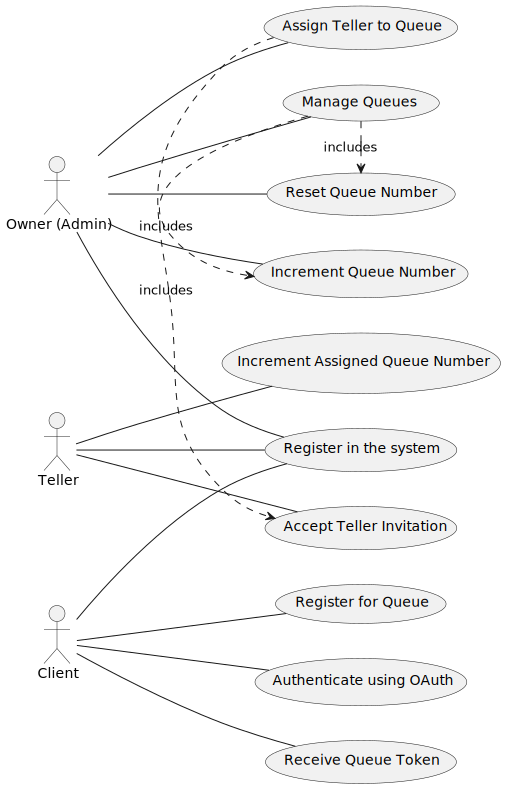

# Hiwi
Hiwi is a Queue Management System designed to efficiently manage user queues.

## User Story: Queue Management System

Users can take on one of three roles: Owner (Admin), Teller, or Client. To access the system, all users must first register.

### Owner
The Owner can manage queues with full CRUD (Create, Read, Update, Delete) functionality. Each queue is identified by a unique prefix and a maximum number. Queue numbering begins with the prefix followed by zero (0) and increments by 1 as the queue progresses. The Owner can reset the queue number to zero or manually increment it as needed.

### Teller
The Owner can assign users as Tellers for specific queues by sending an invitation. The user must accept the invitation to confirm their role as a Teller. Once confirmed, Tellers are authorized to increment the queue numbers for the queues assigned to them.

### Client
Clients are users who wish to join a queue and obtain a queue number. Registration is required, which can be done by scanning a barcode or entering a queue ID through the web or mobile app. During registration, clients must provide their email address, phone number, and full name, or authenticate using **OAuth**. These identifiers help Tellers confirm clients' identities when their queue numbers are called or displayed. Upon successful registration, clients receive their queue number and a token (QR or barcode), which is sent via the web app, email, and mobile app notifications. This token simplifies the confirmation process.

### Queue
A queue has a human-friendly name for easy identification and a description that provides context, such as location, event, owner, or purpose. Each queue has two statuses: **Active** and **Inactive**. When a queue is active, its numbers can be incremented. Inactive status disables this functionality. Queues are visually distinguished by their prefixes (e.g., C90, XY456). A queue can have multiple Tellers managing it and multiple Clients registered, each with a unique queue number.

## Requirements

| Number | Code          | Description                                                                 | Status      | Developer | Remarks |
|--------|---------------|-----------------------------------------------------------------------------|-------------|-----------|---------|
| 1      | USR-REG       | Users must register to use the system.                                     | Completed   | Naufal, Ariya          |         |
| 2      | OWN-CRUD      | Owners can manage (create, read, update, delete) queues.                   | Completed   |Erdine, Ariya         |         |
| 3      | OWN-ASSIGN    | Owners can assign Tellers to queues via invitations.                       | Completed     |  Alejandro, Naufal, Affan, Erdine       |         |
| 4      | OWN-RESET     | Owners can reset queue numbers back to zero.                               | Completed     |    Affan       |         |
| 5      | OWN-INCREMENT | Owners can increment queue numbers.                                        | Completed     | Erdine, Affan, Naufal          |         |
| 6      | TEL-INCREMENT | Tellers can increment queue numbers assigned to them.                      | Completed     |     Wahyu      |         |
| 7      | CLI-REGISTER  | Clients can register for a queue using a barcode scan or queue ID.         | Completed    |     Defis,Putra |         |
| 8      | CLI-OAUTH     | Clients can authenticate via OAuth during registration.                    | Completed     |     Wahyu      |         |
| 9      | CLI-DATA      | Clients must provide their email, phone number, and full name during registration. | Completed     | Bryan      |         |
| 10     | CLI-TOKEN     | Clients receive queue numbers and tokens (QR/barcode) after registration.  | Completed     |  Bryan         |         |
| 11     | Q-MANAGE      | Queues must have a name and description.                                   | Completed     |  Ariya         |         |
| 12     | Q-STATUS      | Queues must have two statuses: Active and Inactive.                        | Completed    |   Ariya        |         |
| 13     | Q-PREFIX      | Queue numbers must start with a prefix (e.g., C90, XY456).                 | Completed     | Ariya    |         |
| 14     | Q-MULTI-TELL  | A queue can have multiple Tellers assigned.                                | Completed     |     Astria      |         |
| 15     | Q-MULTI-CLI   | A queue can have multiple Clients registered.                              | Completed   |     Bryan      |         |
| 16    | TEL - USER  | A user can be a teller invited via email.                                     | Completed   |     Naufal, Affan, Erdine     |         |
| 17    | VIEW  | A client/user can view the queue number prefix                                      | Completed   |     Naufal, Affan, Erdine     |         |

### States of the Status Column

The **Status** column indicates the progress of each requirement. The possible states are:

1. **Pending**: The requirement has been identified but work has not started.
2. **In Progress**: The requirement is currently being implemented.
3. **Completed**: The requirement has been fully implemented and verified.
4. **On Hold**: Work on the requirement is paused due to dependencies or other issues.
5. **Rejected**: The requirement was reviewed but will not be implemented.
6. **Under Review**: The requirement is being evaluated or tested for further action.

# Diagrams
## Usecase Diagram

<!-- ## Activity Diagram

## Sequence Diagram

## Class Diagram

## Entity Diagram 
 -->
